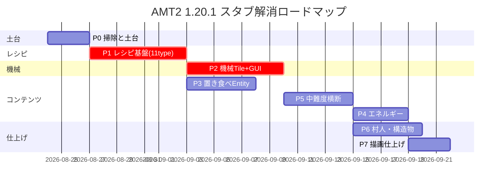

# AMT2 スタブ解消・機能実装マスタープラン

> 作成日: 2026-08-24
> 目的: 1.20.1 移植作業で残された **スタブ/未実装クラス約230ファイル相当** を洗い出し、
> 機能実装を全体として進めるための工程計画。テスト体制は [TEST_PLAN.md](./TEST_PLAN.md) / [checklist.html](./checklist.html) を併用。
>
> 方針: 「低難度の掃除 → レシピ基盤 → 機械Tile+GUI → 置き食べEntity → エネルギー → 村生成」の順で、
> 各フェーズ完了時に `gradlew build` + GameTest が GREEN であることを維持する。

---

## 0. 現状サマリ（スタブ監査結果）

| カテゴリ | 件数 | 主な内容 |
|---|---:|---|
| 完全空クラス `{}` | 28 | entity 2 / world 4 / event 7 / handler 8 / plugin 3 / recipe 6 |
| no-opスタブ（削除候補） | 6 | DCsRecipeRegister, RegisterMakerRecipe, RegisterOreHandler, FluidContainerRegisterEvent, VillageCreateHandle×2 |
| 空 tick TileEntity（NBT未保存含む） | 13 | appliance 9 / energy 3 / brewing系 2 |
| 空GUI Container | 4 | Processor / AdvProcessor / IceMaker / Evaporator |
| TODO残 Item（tooltip中心） | 58ファイル/76箇所 | use実装が必要なのは約15クラス |
| 旧ソース埋め込み Block | 82 | 全て "Original 1.7.10 source" コメント付き（参照元として活用可） |
| 空/部分実装 Entity | 19 | Placeable*×13 / MelonBomb / SilkyMelon / YuzuBullet ほか |
| レシピSerializerダミー | 11種 | `ModRecipes.DummySerializer` |
| クライアントレンダラースタブ | 6 | BEWLR 5 + ClientProxy |

**重要な資産**: Block/Item の大半には旧1.7.10ソースがコメントで埋め込まれているため、
実装時は git history より先に **ファイル内の埋め込み旧ソースを参照** する。

---

## Phase P0: 掃除と土台（難度 低）

**目的**: ノイズ除去と共通基盤整備。全て機械的作業。

| # | タスク | 対象 | 備考 |
|---|---|---|---|
| P0-1 | no-opスタブ6種の削除 | `DCsRecipeRegister`, `RegisterMakerRecipe`, `RegisterOreHandler`, `FluidContainerRegisterEvent`, `VillageCreateHandle*` ×2 | plan.md P2方針に従う。呼出元0件確認してから削除 |
| P0-2 | tooltip一括復元 | item/** 58ファイル | 埋め込み旧ソースの `addInformation` → `appendHoverText` へ機械的に移植。スクリプト化検討（scripts/ 配下） |
| P0-3 | Tile基底クラスのNBT保存実装 | `TileHasDirection`, `TileHasRemaining(2)`, `saveAdditional` 共通化 | まず基底を固めて子クラスへ展開 |
| P0-4 | `DummySerializer` の置き換え設計確定 | ModRecipes.java | MapCodec or fromJson 方式を11タイプ共通の抽象親で統一（P1の前提） |
| P0-5 | ClientProxy の BER 登録骨格 | client/ClientProxy.java | BlockEntityRenderers.register を空実装でも良いので配線だけ通す |

**完了条件**: `build` 成功 + tooltip がゲーム内表示される + 空クラス警告ゼロ。

## Phase P1: レシピ基盤（難度 高／最重要クリティカルパス）

**目的**: 11 RecipeType のうち実データが動くようにする。機械装置より先に着手（Tick処理はレシピに依存するため）。

| # | タスク | 対象 | 元レシピ数 |
|---|---|---|---|
| P1-1 | 抽象Recipe親クラス作成（入出力+MapCodec） | 新規 `recipe/base/AMTRecipeBase.java` | — |
| P1-2 | TeaMaker レシピ (teaRecipe 20種) | `TeaRecipeRegister.java` + JSON datagen | 20 |
| P1-3 | IceMaker レシピ (iceRecipe 13+4種, 空容器返却/燃料登録含む) | `IceRecipeRegister.java`(既存骨格あり) | 17 |
| P1-4 | Pan レシピ (panRecipe 10種, registerHeatSource含む) | `PanRecipeRegister.java`(既存骨格あり) | 10 |
| P1-5 | Plate(Teppan) レシピ (plateRecipe 7種) | 新規実装 | 7 |
| P1-6 | Processor レシピ (50+種, タグ指定材料対応) | `ProcessorRecipeRegister.java` | 50+ |
| P1-7 | AdvProcessor (OreCrushRecipe 含む tier分岐) | `OreCrushRecipe.java` + 上位版 | 10+ |
| P1-8 | Evaporator レシピ (流体→液体/アイテム 15種) | `EvaporatorRecipeRegister.java` | 15 |
| P1-9 | Brewing レシピ (樽醸造 7種, 若酒→完成酒) | `BrewingRecipe.java` | 7 |
| P1-10 | Fondue / Chocolate / Charge レシピ | 未実装3種 | 27 |
| P1-11 | IMC受信 (`ReceivingIMCEvent`) の新API対応 | ReceivingIMCEvent.java | アドオン互換 |

**完了条件**: 各RecipeTypeにつき最低1件がJSON datagenから登録され、GameTestで照合できる。
→ `RegistrationGameTests` に「レシピ存在テスト」を追加（test/TEST_PLAN.md C-1〜C-6の自動部分）。

## Phase P2: 機械 TileEntity + GUI（難度 高）

**目的**: 調理装置が実際に動く状態に。Phase P1のレシピを消費する側。

| # | タスク | 対象Tile | GUI Container | 難度メモ |
|---|---|---|---|---|
| P2-1 | NBT保存の完全実装（items[]直列化） | 全13種 | — | `load/saveAdditional` を最初に固める |
| P2-2 | TeaMakerNext tick（燃料/水/茶葉→完成品） | TileMakerNext | — | GUIなしでも右クリック操作で動く形から |
| P2-3 | Pan / FilledSoupPan 加熱進行 | TilePanG, TileFilledSoupPan | — | HeatSource 判定（下ブロックが火/溶鉱炉等） |
| P2-4 | TeppanII 調理段階遷移 | TileTeppanII | — | 生→焼き→焦げの state 遷移 |
| P2-5 | Processor / AdvProcessor tick | TileProcessor, TileAdvProcessor | ContainerProcessor / AdvProcessor | 14スロット、副産物スロット、充電消費 |
| P2-6 | IceMaker tick | TileIceMaker | ContainerIceMaker | バイオーム高温判定・charge消費 |
| P2-7 | Evaporator tick（流体タンク） | TileEvaporator | ContainerEvaporator | FluidTank capability 必須 |
| P2-8 | Barrel / Cordial 醸造進行 | TileBrewingBarrel, TileCordial | — | 時間ベース発酵 |
| P2-9 | IncenseBase お香効果付与 | TileIncenseBase | — | AABB内プレイヤーへの効果適用ループ |
| P2-10 | Menu/Screen 描画（プログレスバー・流体ゲージ） | client/gui/** | 上記4種 | エクスポート元画像なし・自前描画 |

**完了条件**: TEST_PLAN C-1〜C-9 の自動GameTestがGREEN（加工フロー完遂）、手動チェックリストC群がPASS。

## Phase P3: 置き食べEntity + 描画（難度 高）

**目的**: ver2の目玉機能「設置できる食べ物」の復活。

| # | タスク | 対象 | メモ |
|---|---|---|---|
| P3-1 | PlaceableEntityBase 抽象化（NBT/synchedData/インタラクト） | 新規 base クラス | 13種共通の設置・摂食・回収ロジック |
| P3-2 | Placeable* 13種の実体化 | entity/edible/Placeable*.java ×13 | defineSynchedData + addAdditionalSaveData |
| P3-3 | 対応 BER 実装 | client/render/ 新規 | Model* 3種は LayerDefinition 化済み（流用可） |
| P3-4 | EdibleEntityItem の右クリック設置 | item/edible/EdibleEntityItem(2) 等 | use() TODO 解消 |
| P3-5 | MelonBomb / SilkyMelon / YuzuBullet 完成 | entity/EntityMelonBomb 等 | 部分実装からの完成 |
| P3-6 | IllusionMobs / AnchorMissile | entity/dummy/ | AI+パーティクル |

**完了条件**: TEST_PLAN B群（B-M01〜B-M05）手動チェック PASS。

## Phase P4: エネルギーシステム（難度 高）

**目的**: 柚子電池・Forge Energy 移行の完成。

| # | タスク | 対象 | メモ |
|---|---|---|---|
| P4-1 | ChargeItemManager 相当のCapability設計 | api/charge/** | 旧IChargeItem → IEnergyStorage橋渡し |
| P4-2 | TileChargerBase / Device 充放電 | tile/energy/ ×3 | Forge Energy capability 実装 |
| P4-3 | BatBox / HandleEngine 動力 | BlockBatBox, TileHandleEngine | 回転アニメ(BER)含む |
| P4-4 | Gel系ブロック反応 | redGel / yuzuGel / gelBat | 設置・燃焼・帯電挙動 |
| P4-5 | ItemBattery 残量表示・ItemYuzuGatling 発射 | item/appliance/ | tooltip + use TODO 解消 |

**完了条件**: TEST_PLAN E群 自動+E-M01〜E-M05 手動 PASS。

## Phase P5: イベント・ハンドラ・その他中難度（並行可）

| # | タスク | 対象 | メモ |
|---|---|---|---|
| P5-1 | CraftingEvent（容器返却+実績発火） | event/CraftingEvent.java | AdvancementHolder 化 |
| P5-2 | DCsLivingEvent（charm無効化・ワープキー） | event/DCsLivingEvent.java | |
| P5-3 | EntityMoreDropEvent（姫貝ボーナス） | event/EntityMoreDropEvent.java | |
| P5-4 | 空イベント7種（BucketFill/Bonemeal/Hurt/Dispenser/EatFood等） | event/*.java | 各現代Forgeイベントへの対応 |
| P5-5 | container系Block右クリック（圧縮箱21種） | block/container/** | GUI不要なものから |
| P5-6 | edible系Block破壊→Entityスポーン | block/edible/** | P3とセット |
| P5-7 | plants系成長・収穫（椿/柚子/茶/ミント/カシス） | block/plants/** | WorldGenYuzuTrees流用可 |
| P5-8 | CustomExplosion / FluidContMap / NetworkUtil 等 | handler/** | |
| P5-9 | AddChestGen → loot table 移管 | common/world/AddChestGen.java | GlobalLootModifiers 流用 |

## Phase P6: 村人・村構造物（難度 高／最後）

| # | タスク | 対象 | メモ |
|---|---|---|---|
| P6-1 | VillagerCafe / VillagerYome の1.20.1職業再設計 | entity/Villager*.java | VillagerProfession + POI + 取引 datapack |
| P6-2 | Cafe / Warehouse 構造物の StructureTemplate(NBT)化 | world/village/** | 旧コード生成→NBT書き出しツール検討 |
| P6-3 | Jigsaw/Structure 登録と biome modifier | ModBiomeModifiers 流用 | |
| P6-4 | 取引一覧の datapack 化 | data/defeatedcrow/ | |

**完了条件**: TEST_PLAN I群 手動 PASS。

## Phase P7: クライアント描画仕上げ（難度 高）

| # | タスク | 対象 |
|---|---|---|
| P7-1 | BEWLR 5種（HandleEngine/EightEyesArm/CocktailSP/FossilCannon/YuzuGatling）のBER/BEWLR移植 | client/item/Render*.java |
| P7-2 | ModParticleTypes 新設とパーティクル登録 | client/ModParticles.java |
| P7-3 | 流体テクスチャ・液面描画の最終確認 | fluids 関連 |

**完了条件**: checklist.html J群（見た目系）PASS。

---

## マイルストーン

## 完了判定

各フェーズ終了時に以下を実施し、結果を `doc/qa-summary.md` に追記:
1. `$env:JAVA_HOME=...; .\gradlew build` → BUILD SUCCESSFUL
2. `.\gradlew runGameTestServer` → 全GameTest GREEN
3. `runClient` + `test/checklist.html` で該当カテゴリの手動項目を実施・記録

## リスクと備考

- **P1が最大のボトルネック**: DummySerializer 11種が全機械の前置き。ここが動かないと P2 以降の検証が不可能。
- **Block/Item の埋め込み旧ソース**は SJIS→UTF-8 変換済みとはいえ一部文字化けの可能性。git history (`AppleMilkTea2_1.7.10` 本家) を併読。
- **外部MOD連携**（IC2/CoFH等）は plan.md の Omit 分類に従い、Forge Energy 統一のみ実施。
- **Bamboo連携のみ保留**（1.20.1版あり）。P5 完了後に改めて差分検証。
