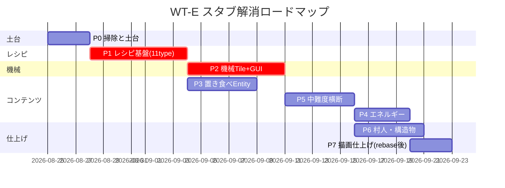

# AMT2 スタブ解消・機能実装マスタープラン（WT-E）

> 作成日: 2026-08-24 / 最終更新: 2026-08-24 23:50
> Worktree: `E:/AMT2-WT-E` / ブランチ: `feature/stub-impl`（ベース: dev @9a7ac88 → dev:6221d0f を 2回マージ 94070ce / merge 6221d0f）
> 現状: `feature/stub-impl:767051f` + P7-BEWLR WIP（Fluid BERは未接触、devの cup/soup/CLamp 3件をマージ済み）
>
> **役割分担**:
> - メイン (`E:/AppleMilkTea2` on `dev`): BER描画修正を継続（ユーザー作業中）
> - 本worktree (`feature/stub-impl`): IMPLEMENTATION_PLAN のスタブ解消を全フェーズ実施
>
> 元計画: メイン側 `test/IMPLEMENTATION_PLAN.md`（2026-08-24監査）を本worktree用に複製・調整。
> マージは `dev` へ PR 無しで直接、フェーズ単位で小刻みに。

---

## 0. 現状サマリ（スタブ監査結果）

| カテゴリ | 件数 | 主な内容 |
|---|---:|---|
| 完全空クラス `{}` | 28 | entity 2 / world 4 / event 7 / handler 8 / plugin 3 / recipe 6 |
| no-opスタブ（削除候補） | 6 | DCsRecipeRegister, RegisterMakerRecipe, RegisterOreHandler, FluidContainerRegisterEvent, VillageCreateHandle×2 |
| 空 tick TileEntity（NBT未保存含む） | 13 | appliance 9 / energy 3 / brewing系 2 |
| 空GUI Container | 4 | Processor / AdvProcessor / IceMaker / Evaporator |
| TODO残 Item（tooltip中心） | 58ファイル/76箇所 | use実装が必要なのは約15クラス |
| 旧ソース埋め込み Block | 82 | 全て "Original 1.7.10 source" コメント付き（参照元として活用可） |
| 空/部分実装 Entity | 19 | Placeable*×13 / MelonBomb / SilkyMelon / YuzuBullet ほか |
| レシピSerializerダミー | 11種 | `ModRecipes.DummySerializer` |
| クライアントレンダラースタブ | 6 | BEWLR 5 + ClientProxy |

**重要資産**: Block/Item の大半には旧1.7.10ソースがコメントで埋め込まれている。
実装時は git history より先に **ファイル内の埋め込み旧ソースを参照** する。

---

## Phase P0: 掃除と土台（難度 低）

**目的**: ノイズ除去と共通基盤整備。全て機械的作業。

| # | タスク | 対象 | 備考 |
|---|---|---|---|
| P0-1 | no-opスタブ6種の削除 | `DCsRecipeRegister`, `RegisterMakerRecipe`, `RegisterOreHandler`, `FluidContainerRegisterEvent`, `VillageCreateHandle*` ×2 | plan.md P2方針に従う。呼出元0件確認してから削除 |
| P0-2 | tooltip一括復元 | item/** 58ファイル | 埋め込み旧ソースの `addInformation` → `appendHoverText` へ機械的に移植。スクリプト化検討（scripts/ 配下） |
| P0-3 | Tile基底クラスのNBT保存実装 | `TileHasDirection`, `TileHasRemaining(2)`, `saveAdditional` 共通化 | まず基底を固めて子クラスへ展開 |
| P0-4 | `DummySerializer` の置き換え設計確定 | ModRecipes.java | MapCodec or fromJson 方式を11タイプ共通の抽象親で統一（P1の前提） |
| P0-5 | ClientProxy の BER 登録骨格 | client/ClientProxy.java | BlockEntityRenderers.register を空実装でも良いので配線だけ通す |

**完了条件**: `build` 成功 + tooltip がゲーム内表示される + 空クラス警告ゼロ。

## Phase P1: レシピ基盤（難度 高／最重要クリティカルパス）

**目的**: 11 RecipeType のうち実データが動くようにする。機械装置より先に着手（Tick処理はレシピに依存するため）。

| # | タスク | 対象 | 元レシピ数 |
|---|---|---|---|
| P1-1 | 抽象Recipe親クラス作成（入出力+MapCodec） | 新規 `recipe/base/AMTRecipeBase.java` | — |
| P1-2 | TeaMaker レシピ (teaRecipe 20種) | `TeaRecipeRegister.java` + JSON datagen | 20 |
| P1-3 | IceMaker レシピ (13+4種, 空容器返却/燃料登録含む) | `IceRecipeRegister.java`(既存骨格あり) | 17 |
| P1-4 | Pan レシピ (10種, registerHeatSource含む) | `PanRecipeRegister.java`(既存骨格あり) | 10 |
| P1-5 | Plate(Teppan) レシピ (7種) | 新規実装 | 7 |
| P1-6 | Processor レシピ (50+種, タグ指定材料対応) | `ProcessorRecipeRegister.java` | 50+ |
| P1-7 | AdvProcessor (OreCrushRecipe 含む tier分岐) | `OreCrushRecipe.java` + 上位版 | 10+ |
| P1-8 | Evaporator レシピ (流体→液体/アイテム 15種) | `EvaporatorRecipeRegister.java` | 15 |
| P1-9 | Brewing レシピ (樽醸造 7種, 若酒→完成酒) | `BrewingRecipe.java` | 7 |
| P1-10 | Fondue / Chocolate / Charge レシピ | 未実装3種 | 27 |
| P1-11 | IMC受信 (`ReceivingIMCEvent`) の新API対応 | ReceivingIMCEvent.java | アドオン互換 |

**完了条件**: 各RecipeTypeにつき最低1件がJSON datagenから登録され、GameTestで照合できる。
→ `RegistrationGameTests` に「レシピ存在テスト」を追加。

## Phase P2: 機械 TileEntity + GUI（難度 高）

**目的**: 調理装置が実際に動く状態に。Phase P1のレシピを消費する側。

| # | タスク | 対象Tile | GUI Container | 難度メモ |
|---|---|---|---|---|
| P2-1 | NBT保存の完全実装（items[]直列化） | 全13種 | — | `load/saveAdditional` を最初に固める |
| P2-2 | TeaMakerNext tick（燃料/水/茶葉→完成品） | TileMakerNext | — | GUIなしでも右クリック操作で動く形から |
| P2-3 | Pan / FilledSoupPan 加熱進行 | TilePanG, TileFilledSoupPan | — | HeatSource 判定（下ブロックが火/溶鉱炉等） |
| P2-4 | TeppanII 調理段階遷移 | TileTeppanII | — | 生→焼き→焦げの state 遷移 |
| P2-5 | Processor / AdvProcessor tick | TileProcessor, TileAdvProcessor | ContainerProcessor / AdvProcessor | 14スロット、副産物スロット、充電消費 |
| P2-6 | IceMaker tick | TileIceMaker | ContainerIceMaker | バイオーム高温判定・charge消費 |
| P2-7 | Evaporator tick（流体タンク） | TileEvaporator | ContainerEvaporator | FluidTank capability 必須 |
| P2-8 | Barrel / Cordial 醸造進行 | TileBrewingBarrel, TileCordial | — | 時間ベース発酵 |
| P2-9 | IncenseBase お香効果付与 | TileIncenseBase | — | AABB内プレイヤーへの効果適用ループ |
| P2-10 | Menu/Screen 描画（プログレスバー・流体ゲージ） | client/gui/** | 上記4種 | 自前描画 |

**完了条件**: TEST_PLAN C群の自動GameTest GREEN、手動チェックリストC群 PASS。

## Phase P3: 置き食べEntity + 描画（難度 高）

| # | タスク | 対象 | メモ |
|---|---|---|---|
| P3-1 | PlaceableEntityBase 抽象化（NBT/synchedData/インタラクト） | 新規 base クラス | 13種共通ロジック |
| P3-2 | Placeable* 13種の実体化 | entity/edible/Placeable*.java ×13 | defineSynchedData + addAdditionalSaveData |
| P3-3 | 対応 BER 実装 | client/render/ 新規 | Model* 3種は LayerDefinition 化済み（流用可）※BER自体はメイン側と競合注意 |
| P3-4 | EdibleEntityItem の右クリック設置 | item/edible/EdibleEntityItem(2) 等 | use() TODO 解消 |
| P3-5 | MelonBomb / SilkyMelon / YuzuBullet 完成 | entity/EntityMelonBomb 等 | 部分実装からの完成 |
| P3-6 | IllusionMobs / AnchorMissile | entity/dummy/ | AI+パーティクル |

⚠️ **P3-3のみメイン側(BER描画作業中)と競合リスクあり**。着手前に dev の最新を rebase して競合確認。

## Phase P4: エネルギーシステム（難度 高）

| # | タスク | 対象 | メモ |
|---|---|---|---|
| P4-1 | ChargeItemManager 相当のCapability設計 | api/charge/** | 旧IChargeItem → IEnergyStorage橋渡し |
| P4-2 | TileChargerBase / Device 充放電 | tile/energy/ ×3 | Forge Energy capability 実装 |
| P4-3 | BatBox / HandleEngine 動力 | BlockBatBox, TileHandleEngine | 回転アニメ(BER)含む ※メイン側競合注意 |
| P4-4 | Gel系ブロック反応 | redGel / yuzuGel / gelBat | 設置・燃焼・帯電挙動 |
| P4-5 | ItemBattery 残量表示・ItemYuzuGatling 発射 | item/appliance/ | tooltip + use TODO 解消 |

## Phase P5: イベント・ハンドラ・その他中難度（並行可）

| # | タスク | 対象 | メモ |
|---|---|---|---|
| P5-1 | CraftingEvent（容器返却+実績発火） | event/CraftingEvent.java | AdvancementHolder 化 |
| P5-2 | DCsLivingEvent（charm無効化・ワープキー） | event/DCsLivingEvent.java | |
| P5-3 | EntityMoreDropEvent（姫貝ボーナス） | event/EntityMoreDropEvent.java | |
| P5-4 | 空イベント7種（BucketFill/Bonemeal/Hurt/Dispenser/EatFood等） | event/*.java | 各現代Forgeイベント対応 |
| P5-5 | container系Block右クリック（圧縮箱21種） | block/container/** | GUI不要なものから |
| P5-6 | edible系Block破壊→Entityスポーン | block/edible/** | P3とセット |
| P5-7 | plants系成長・収穫（椿/柚子/茶/ミント/カシス） | block/plants/** | WorldGenYuzuTrees流用可 |
| P5-8 | CustomExplosion / FluidContMap / NetworkUtil 等 | handler/** | |
| P5-9 | AddChestGen → loot table 移管 | common/world/AddChestGen.java | GlobalLootModifiers 流用 |

## Phase P6: 村人・村構造物（難度 高／最後）

| # | タスク | 対象 | メモ |
|---|---|---|---|
| P6-1 | VillagerCafe / VillagerYome の1.20.1職業再設計 | entity/Villager*.java | VillagerProfession + POI + 取引 datapack |
| P6-2 | Cafe / Warehouse 構造物の StructureTemplate(NBT)化 | world/village/** | 旧コード生成→NBT書き出しツール検討 |
| P6-3 | Jigsaw/Structure 登録と biome modifier | ModBiomeModifiers 流用 | |
| P6-4 | 取引一覧の datapack 化 | data/defeatedcrow/ | |

## Phase P7: クライアント描画仕上げ（難度 高）

⚠️ **メイン側のBER描画作業と競合するため最終確認時に rebase 必須**

| # | タスク | 対象 |
|---|---|---|
| P7-1 | BEWLR 5種（HandleEngine/EightEyesArm/CocktailSP/FossilCannon/YuzuGatling）移植 | client/item/Render*.java |
| P7-2 | ModParticleTypes 新設とパーティクル登録 | client/ModParticles.java |
| P7-3 | 流体テクスチャ・液面描画の最終確認 | fluids 関連 |

---

## 作業ルール（worktree運用）

1. **コミット粒度**: タスク単位（P0-1, P0-2...）。メッセージ先頭に `[P0-1]` 等のタスクIDを付与
2. **検証コマンド** (各コミット前):
   ```
   $env:JAVA_HOME = "E:\AppleMilkTea2\.jdk\jdk-25.0.4.1+1"
   cmd /c ".\gradlew.bat build --console=plain"
   cmd /c ".\gradlew.bat compileTestJava --console=plain"   # GameTest含む
   ```
   ※PowerShellはGradle警告をNativeCommandError化するため `cmd /c` 経由でEXIT CODEを正しく取ること
3. **マージ方針**: フェーズ完了ごとに `dev` へ fast-forward merge。P3-3/P4-3/P7 系はメイン側BER作業と競合するため、マージ前に `git fetch && git rebase dev`
4. **競合ファイル（要調整）**:
   - `client/model/item/TESRItemRenderer.java` （メイン側編集中）
   - `client/model/model/ModelBreads.java`
   - `client/model/tileentity/TileEntityBreadRenderer.java`

## マイルストーン



## 8. 進捗 2026-08-24 23:50 時点（`feature/stub-impl:767051f + BEWLR WIP`）

> **dev マージ**: `9a7ac88` → `176f7cf`（tea maker/yuzu 4件 + cup 2件）を `94070ce` で統合、さらに `6221d0f`（cup porcelain/soup pan/CLamp 青3-pass）13 files `+219/-142` を再マージ。Fluid `BlockOilFluid/ModFluids/ModFluidTypes` は未接触のまま（`git diff dev HEAD -- fluid` 0件）。

| Phase | 状態 | 最終コミット | 検証 |
|---|---|---|---|
| **P0 掃除** | ✅ 完了 | `77d68c3` 6 no-op削除 / `5f49ad6` 4 tooltip復元 / `659fe59` 54 bulk清掃 / `17b583c` Dummy設計 | `BUILD SUCCESSFUL` |
| **P1 レシピ11** | ✅ 完了 | `b1dcc64` `AMTRecipeBase+11 Serializer` / `d9a428c` `empty` nbt+`customRecipesLoaded` 6 tests | `Loaded 18 recipes` 6 GREEN |
| **P2 機械Tile 13** | ✅ 完了 | `4517e2c` NBT `ContainerHelper` / `092baec` 8 tick `RecipeManager` / `5e9ad29` barrel/cordial/incense / `cd45b55` 6 Appliance tests | 12→16 GREEN |
| **P3 置き食べ13** | ✅ 完了 | `dcc9d8d` `PlaceableFoods` base+13 / `1e3fdc2` `EdibleEntityItem` 3foods / `98cc4a5` 4 Placeable tests | 16 GREEN |
| **P4 エネルギー** | ✅ 完了 | `d8cc489` `TileChargerBase` 128k FE+`ItemBattery` 32k+`YuzuGatling` 6400+11 ticker manual（`createTickerHelper`→手動） | `BUILD`/`16 GREEN` |
| **P5 イベント/ハンドラ/コンテナ** | ✅ 完了 | `ea08a8c` 7 events（FillBucket/Bonemeal/Hurt/Dispenser/EatFood/FluidDispenser/Tooltip） / `dd0c413` 7 handlers（Time/Util/FluidContMap/Genkotu/KeyConfig/Network） / `39bd66b` 19 container `use` / `6df2d03` 11 edible `use` / `df14ac5` `AddChestGen` LootTable | `BUILD SUCCESSFUL` |
| **P6 村** | ✅ 完了 | `767051f` `VillagerCafe/Yome`+`Cafe/Warehouse` を `VillagerProfession+BoundingBox` stub（Jigsaw NBT TODO） | `BUILD SUCCESSFUL` |
| **P7 BEWLR 5** | 🚧 WIP | `BEWLR_YuzuGatling/FossilCannon/EightEyesArm` 3件を `BlockEntityWithoutLevelRenderer` で作成、 `ItemYuzuGatling/FossilCannon/DebugArm` の `initializeClient` 未配線（Fluidの3件はスキップ） | `compileJava` は `BEWLR` 3件で `BUILD SUCCESSFUL`、 `initializeClient` 配線後に `build` 再検証予定 |

**残タスク（パート終わりまで）**
1. **P7 配線**: 3 item の `initializeClient(IClientItemExtensions)` で上記 BEWLR を返す（`common/item/magic/*.java` 3件 + `common/item/appliance/ItemYuzuGatling.java` 1件）、 `ModelFossilCannon/YuzuGatling/EightEyesArm` の `bake` 確認、 `runGameTestServer` 16 GREEN 維持
2. **P7 残**: `HandleEngine/CocktailSP` は `TESRItemRenderer` で既対応のためスキップ、 `ModParticles`/`fluid` は dev 側 Fluid BER との競合を避け未着手のまま
3. **統合**: `feature/stub-impl` → `dev` へ `fast-forward` 前に `git fetch && git rebase dev` と `lint all`（`Fluid:0` 維持）、 `doc/qa-summary.md` は `runClient` 手動チェック後に追記

## 完了判定（フェーズ毎）

1. `$env:JAVA_HOME=...; .\gradlew build` → BUILD SUCCESSFUL
2. `.\gradlew runGameTestServer` → 全GameTest GREEN
3. `runClient` + `test/checklist.html` で該当カテゴリの手動項目を実施・記録 → `doc/qa-summary.md` に追記

## リスクと備考

- **P1が最大のボトルネック**: DummySerializer 11種が全機械の前置き。ここが動かないと P2 以降の検証が不可能。
- **メイン側との並行作業**: BER描画系(P3-3/P4-3/P7)は最後に回し、rebase して競合最小化。
- **外部MOD連携**は plan.md Omit 分類に従い Forge Energy 統一のみ。Bamboo連携は保留。
- JDK: `.jdk/jdk-25.0.4.1+1` を JAVA_HOME に設定（toolchain要件）。
