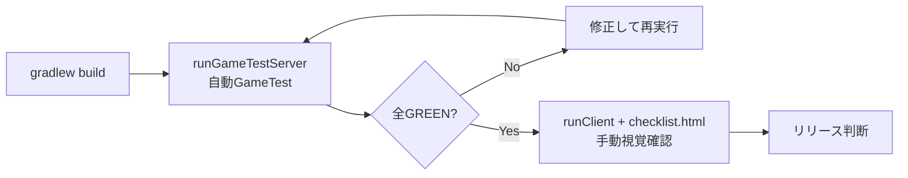

# AppleMilkTea2 (1.20.1 移植版) 機能テスト計画

> 参照: [defeatedcrow's MOD Wiki — AppleMilkTea ver2](https://defeatedcrow.wiki.fc2.com/wiki/AppleMilkTea%20ver2) および
> [version2 解説メニュー](https://defeatedcrow.wiki.fc2.com/wiki/AppleMilkTea%20version2%20%E8%A7%A3%E8%AA%AC%E3%83%A1%E3%83%8B%E3%83%A5%E3%83%BC)
>
> 目的: wiki で解説されている ver2 の全機能を、1.20.1 移植版 (`DCsAppleMilk`, FG6 / mojmap / JDK17) が
> 正しく再現しているかを検証する。自動テスト (GameTest) + 手動チェックリスト (HTML) の二段構え。
>
> 関連: 手動チェックリストは `test/checklist.html` / GameTest 実装は `src/test/java/mods/defeatedcrow/test/`

---

## 1. スコープと方針

| 分類 | 検証手段 | 理由 |
|---|---|---|
| レシピ登録・機械の加工ロジック | **GameTest** (自動) | サーバー側ロジックで完結する |
| 充電システム・エネルギー換算 | **GameTest** (自動) | 数値検証に向く |
| ワールド生成・村人取引 | **GameTest** + 手動 | 生成は構造物依存、取引UIは手動 |
| 見た目・描画 (モデル/BER/流体テクスチャ) | **手動チェックリストのみ** | 人間の目でしか判定できない |
| GUI 操作感・音・パーティクル | **手動チェックリストのみ** | 同上 |

実行コマンド:
- 自動テスト: `.\gradlew runGameTestServer` (タスク `prepareRunGameTestServerCompile` で事前コンパイル)
- 手動確認: `.\gradlew runClient` で `test/checklist.html` をブラウザで開きながら進める

---

## 2. テスト対象カテゴリ (wiki解説メニュー準拠)

### A. 新しい作物
wiki: 椿の実 / 柚子の木

| # | テスト項目 | 方法 |
|---|---|---|
| A-1 | 椿の実から椿苗木→成長→収穫が回ること | GameTest(骨粉成長) |
| A-2 | 柚子の木: 苗木→成長→柚子の実がつくこと | GameTest |
| A-3 | 収穫時のドロップ数・種返却の整合 | GameTest |

### B. 飲食物・食べものEntity化
wiki: 食べ物エンティティ / 新規モデルの食べ物

| # | テスト項目 | 方法 |
|---|---|---|
| B-1 | Placeable Food (皿/ボウル/カップ系) の設置 → 右クリックで摂食 → 空容器が返る | GameTest + 手動 |
| B-2 | 摂食イベント (AMT API Event) がキャンセル可能であること | GameTest |
| B-3 | 食べ物エンティティのスポーン/破壊時ドロップ | GameTest |
| B-4 | 各モデル・レンダリング (ケーキ型, カクテル, ティーカップ等) の見た目 | **手動のみ** |

### C. 調理装置 (旧版継続 + ver2新規)
wiki: 新型ティーメーカー / 新鍋 / 新鉄板 / フードプロセッサー / 減圧蒸留器 / ジョークラッシャー / 電池で動く新装置

| # | テスト項目 | 方法 |
|---|---|---|
| C-1 | TeaMakerNext: レシピ登録API (`teaRecipe`) 経由の加工、ミルク有無の分岐 | GameTest |
| C-2 | IceMaker: レシピ13+4種、空容器返却レシピ、燃料登録 | GameTest |
| C-3 | Pan (EmptyPanGaiden): panRecipe 10種の入出力 | GameTest |
| C-4 | TeppanII: plateRecipe 7種、生焼け/焦げ遷移 | GameTest |
| C-5 | Processor / AdvProcessor: processorRecipe 50+/10+ 種、副産物、鉱石辞書(タグ)指定 | GameTest |
| C-6 | Evaporator: 流体入力→完成品(液体/アイテム)出力 15種 | GameTest |
| C-7 | 各装置の進行ゲージ・燃料消費・レッドストーン停止 | GameTest |
| C-8 | GUI内スロット操作・プログレスバー描画 | **手動のみ** |

### D. 酒造システム
wiki: 醸造樽 / 果実酒 / カクテル / 追加ポーション効果

| # | テスト項目 | 方法 |
|---|---|---|
| D-1 | Barrel + Cordial/LargeBottle での醸造レシピ 7種 (brewingRecipe) | GameTest |
| D-2 | 醸造16種流体の登録・流出入 | GameTest |
| D-3 | カクテル/酒のポーション効果付与 (10種 MobEffect) | GameTest |
| D-4 | 飲用時の効果・酔い演出の見た目 | 手動 |

### E. 柚子電池と新エネルギー
wiki: 電池アイテム / 充電システムと充電装置 / 柚子と赤石のジェル

| # | テスト項目 | 方法 |
|---|---|---|
| E-1 | YuzuBat/GelBat の充放電 (chargeItem 登録5種) | GameTest |
| E-2 | BatBox / HandleEngine による充電動作 | GameTest |
| E-3 | RF/EU/GF 換算 (exchangeRate*) — 1.20.1では Forge Energy へ全面書換済 | GameTest |
| E-4 | ジェルブロック (redGel/yuzuGel/gelBat) の設置・反応 | GameTest |

### F. 魔法のお香立て
wiki: 玉髄の香立て / 精油とインセンス作成

| # | テスト項目 | 方法 |
|---|---|---|
| F-1 | インセンス11種の登録と効果範囲 (Incense API) | GameTest |
| F-2 | お香燃焼中のパーティクル・煙の見た目 | **手動のみ** |

### G. 圧縮ブロック・収納
wiki: 新しい圧縮箱 / 圧縮シルクメロン / キノコブロックのEntity化

| # | テスト項目 | 方法 |
|---|---|---|
| G-1 | WoodBox/VegiBag/CharcoalBox 等の圧縮レシピ・開封 | GameTest |
| G-2 | MelonBomb (圧縮メロン) の爆発/展開 | GameTest |
| G-3 | 大量収納アイテムの中身保持 (NBT保存) | GameTest |

### H. 玉髄 (カルセドニー) 新要素
wiki: 新色カルセドニー / モノクル / オニキスの剣 / 高枝切りバサミ / 感圧板

| # | テスト項目 | 方法 |
|---|---|---|
| H-1 | カルセドニー新色ブロックのクラフト・設置 | GameTest |
| H-2 | Chalcedony Lamp (GlassLamp) の点灯切替 | GameTest |
| H-3 | モノクル (鉱石辞書名表示) / オニキス剣の特殊効果 | GameTest + 手動 |
| H-4 | 高枝切りバサミの葉刈りドロップ | GameTest |

### I. 世界生成・村人
wiki: 新しい村人と建物

| # | テスト項目 | 方法 |
|---|---|---|
| I-1 | Cafe/Yome 村人プロフェッション登録と取引一覧 | GameTest(取引データ)+手動(UI) |
| I-2 | Village Component (Cafe/Warehouse) の生成 — 1.20.1では構造/Jigsaw系へ | 手動中心 |
| I-3 | TeaTree 自然生成 / Clam (ハマグリ砂浜生成) | GameTest(バイオーム条件)+手動 |

### J. コンフィグ・その他
| # | テスト項目 | 方法 |
|---|---|---|
| J-1 | DCsConfig → ForgeConfigSpec の値読み込み・反映 | GameTest |
| J-2 | クリエイティブタブ5種の内容 | GameTest(登録数>0)+手動 |
| J-3 | 実績37種 (Advancement) の発火条件 | GameTest(一部)+手動 |
| J-4 | 他MOD連携 (Bamboo保留分以外はOmit確定) の無効環境でクラッシュしないこと | GameTest(起動即OK) |

---

## 3. 実行フロー

## 4. 判定基準
- **PASS**: 期待値と完全一致 (レシピ結果・スタック数・NBT/コンポーネント含む)
- **WARN**: 動作するが wiki 記載と仕様差異がある → 差異を記録し doc 側に反映
- **FAIL**: クラッシュ・期待外れ・未移植。`doc/qa-summary.md` に起票
